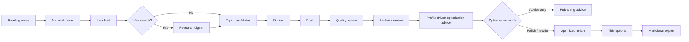
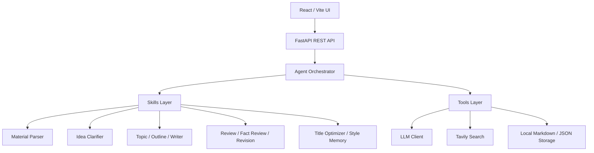

# NoteForge-AI

<p align="center">
  <strong>Turn rough reading notes into sourced, editable WeChat/blog drafts with an AI review gate.</strong>
</p>

<p align="center">
  <a href="README.zh-CN.md">中文 README</a> ·
  <a href="#preview">Preview</a> ·
  <a href="#why-it-exists">Why</a> ·
  <a href="#features">Features</a> ·
  <a href="#quick-start">Quick Start</a> ·
  <a href="#demo-mode">Demo Mode</a> ·
  <a href="#roadmap">Roadmap</a>
</p>

<p align="center">
  
  
  
  
  
</p>

## Preview

<p align="center">
  
</p>

NoteForge-AI is a self-hosted writing workspace for people who read, take notes, and publish long-form ideas. It turns messy notes, excerpts, and half-formed thoughts into a visible writing pipeline: material parsing, idea clarification, optional web research, topic generation, outline drafting, article writing, quality review, fact-risk review, revision, title generation, and Markdown export.

The project is intentionally not a "one-click content farm". Its goal is to let AI handle the heavy first pass while keeping the author's thinking, judgment, and voice in the loop.

## At a Glance

| What you can try | Why it matters |
| --- | --- |
| `写草稿` writing workspace | Paste messy reading notes and watch the pipeline turn them into topic angles, an outline, a draft, review signals, and exportable Markdown. |
| `体检文章` assessment workspace | Paste a finished article and get a publish / revise / hold gate, title candidates, rewrite suggestions, and fact-risk review. |
| Local demo endpoints | Explore the product flow before adding an API key. |
| OpenAI-compatible provider setup | Bring your own OpenAI, DeepSeek, Qwen, or gateway key without changing the app code. |
| Style memory | Let final drafts update a lightweight local writing profile that can influence later edits. |

## Why It Exists

Most AI writing tools start from a prompt and end with a generic draft. NoteForge-AI starts from your own reading notes and keeps the editorial process visible:

- It preserves the raw material and shows how the idea is refined.
- It gives multiple topic angles before committing to a draft.
- It reviews quality and fact risk before publishing.
- It can learn from final drafts to build a lightweight personal style memory.
- It exports Markdown instead of locking content into a platform.

## Features

- Convert reading notes, book excerpts, paper notes, or rough ideas into long-form drafts.
- Generate topic candidates, outlines, full drafts, and title options.
- Run article quality review with score breakdowns and revision targets.
- Check risky factual claims and suggest safer wording or citation needs.
- Use three article optimization modes on the assessment page: advice only, light polish, or publish-ready rewrite.
- Generate profile-driven suggestions that show which local style-memory signals affected the edit priorities.
- Orchestrate the article optimization path with LangGraph StateGraph, leaving room for future human approval, RAG, and diff nodes.
- Use a WeChat deep-polish mode for stronger openings, mobile reading rhythm, section headings, and endings.
- Learn reusable writing style from final drafts.
- Export drafts as Markdown for WeChat, blogs, newsletters, or personal knowledge bases.
- Use any OpenAI-compatible Chat Completions API, including OpenAI, DeepSeek, Qwen, or compatible gateways.
- Try the product flow locally with demo buttons even before adding an API key.
- Keep the first screen simple: write notes first, tune model/search/style options only when needed.

## Product Flow



## Architecture



Core files:

- `backend/app/agents/noteforge_agent.py`
- `backend/app/agents/graphs/article_optimization_graph.py`
- `backend/app/agents/skills/`
- `backend/app/agents/tools/`
- `frontend/src/pages/WritingStudio.tsx`
- `frontend/src/pages/ArticleAssessment.tsx`

## Where to Look First

| Area | Files |
| --- | --- |
| Main agent pipeline | `backend/app/agents/noteforge_agent.py`, `backend/app/agents/graphs/article_optimization_graph.py` |
| Prompt behavior | `backend/app/prompts/` |
| Demo data | `backend/app/agents/demo_data.py` |
| API contracts | `backend/app/schemas/agent.py`, `frontend/src/api/agent.ts` |
| Product UI | `frontend/src/pages/`, `frontend/src/components/`, `frontend/src/style.css` |
| Example material | `examples/` |

## Tech Stack

| Layer | Tech |
| --- | --- |
| Frontend | React, TypeScript, Vite, lucide-react |
| Backend | FastAPI, Pydantic, SQLAlchemy |
| Agent | LangGraph orchestration + OpenAI-compatible Chat Completions API |
| Search | Tavily Search API |
| Storage | Local Markdown / JSON files |
| Deployment | Docker Compose |

## Quick Start

### 1. Configure the backend

```powershell
copy backend\.env.example backend\.env
```

Edit `backend/.env`:

```env
APP_NAME=NoteForge-AI
DATABASE_URL=sqlite:///./noteforge.db
STORAGE_DIR=storage

LLM_PROVIDER=openai
OPENAI_API_KEY=your_api_key
OPENAI_BASE_URL=https://api.deepseek.com
OPENAI_MODEL=deepseek-v4-flash
LLM_MODEL_OPTIONS=
LLM_REQUEST_TIMEOUT=180

SEARCH_PROVIDER=tavily
TAVILY_API_KEY=your_tavily_key

MIN_REVIEW_SCORE=88
```

DeepSeek, Qwen, OpenAI, and other compatible providers can be used by changing `OPENAI_BASE_URL`, `OPENAI_MODEL`, and optionally `LLM_MODEL_OPTIONS`.

Web search is off by default. Enable it only after adding a Tavily key.

### 2. Start the backend

```powershell
cd backend
python -m venv .venv
.\.venv\Scripts\Activate.ps1
pip install -r requirements.txt
python -m uvicorn app.main:app --reload --port 8000
```

API docs:

```text
http://127.0.0.1:8000/docs
```

### 3. Start the frontend

```powershell
cd frontend
npm install
npm.cmd run dev
```

Open:

```text
http://localhost:5173
```

For the shortest path, paste notes into `写草稿`, keep the optional settings collapsed, and click `生成草稿`. Use `体检文章` when you already have a complete draft and only want publishing feedback.

## Demo Mode

You can explore the end-to-end UX without any model key:

1. Start both backend and frontend.
2. Open `http://localhost:5173`.
3. Click `运行 Demo` on the writing page or article assessment page.

Demo mode uses local canned outputs and writes demo Markdown/JSON artifacts to the normal `backend/storage/` folder. Real generation still requires `OPENAI_API_KEY`.

## Docker

Create `backend/.env` first, then run:

```powershell
docker compose up --build
```

Services:

- Frontend: `http://localhost:5173`
- Backend: `http://localhost:8000`

## Examples

Sample inputs and expected outputs live in `examples/`.

- `examples/deep-work-note.md`
- `examples/article-assessment-input.md`
- `examples/demo-output.md`

These examples are designed for README screenshots, issue reproduction, and quick manual QA.

## Project Structure

```text
backend/
  app/
    agents/       Agent orchestration, skills, tools, prompts
    api/          FastAPI routes
    core/         Configuration and shared errors
    models/       SQLAlchemy models
    schemas/      Pydantic request / response models

frontend/
  src/
    api/          REST client and TypeScript types
    components/   Reusable UI panels
    pages/        Writing workspace and article assessment

examples/         Sample notes, articles, and demo output
docs/             Architecture figures and generated docs
```

## Quality Checks

```powershell
cd frontend
npm.cmd run build
```

```powershell
python -m compileall backend\app
```

The GitHub Actions workflow runs both checks on pull requests and pushes.

## Roadmap

- Online hosted demo with preloaded examples.
- Streaming progress updates during long model runs.
- Article version history and diff view.
- Stronger citation tracking and source verification.
- More publishing templates beyond WeChat and blogs.
- Background job queue for long-running workflows.
- Better provider setup wizard for OpenAI-compatible APIs.

## Contributing

Issues, feature ideas, prompt improvements, UI polish, provider compatibility fixes, and documentation examples are welcome. See `CONTRIBUTING.md`.

Good first contributions:

- Add a new example input and expected output.
- Improve a prompt in `backend/app/prompts/`.
- Add a provider setup note for a compatible LLM gateway.
- Improve mobile UI polish in the writing workspace.

## Security

NoteForge-AI is BYOK. Keep your LLM and search keys in `backend/.env`; never commit them to GitHub. Runtime output is stored locally under `backend/storage/`.

## License

MIT
