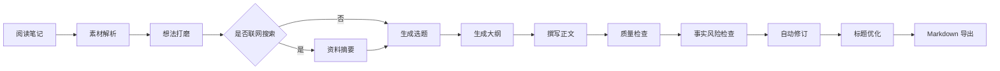
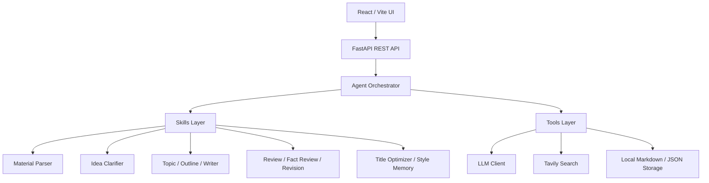

# NoteForge-AI

<p align="center">
  <strong>把阅读笔记、摘录和粗糙想法，锻造成可编辑的公众号 / 博客草稿。</strong>
</p>

<p align="center">
  <a href="#features">Features</a> ·
  <a href="#workflow">Workflow</a> ·
  <a href="#architecture">Architecture</a> ·
  <a href="#quick-start">Quick Start</a> ·
  <a href="#roadmap">Roadmap</a>
</p>

<p align="center">
  
  
  
  
</p>

NoteForge-AI 是一个 Agent 驱动的写作工作台，面向经常阅读、记录、思考，并希望持续输出内容的人。

它会把碎片化的读书笔记、摘录和个人想法，整理成一条可见的写作流程：解析素材、打磨想法、按需联网搜索、生成选题和大纲、撰写正文、质量检查、事实风险检查、自动修订、优化标题，最后导出 Markdown。

目标很简单：让 AI 处理繁重的第一稿，但保留你的思考、判断和个人表达。

## Features

- 把阅读笔记、摘录、论文笔记或粗糙想法转成长文草稿。
- 在正式写作前生成多个选题方向，方便选择角度。
- 自动生成大纲、正文草稿和标题候选。
- 对文章质量做审稿，并检查可能缺少来源支撑的事实表达。
- 当评分或事实风险不达标时，自动进行一次克制修订。
- 从用户确认过的最终稿中学习个人写作风格。
- 支持导出 Markdown，适合公众号、博客和个人知识库。
- 使用真实 OpenAI-compatible LLM API，可选接入 Tavily 联网搜索。

## Workflow



## Architecture



核心文件：

- `backend/app/agents/read2post_agent.py`
- `backend/app/agents/skills/`
- `backend/app/agents/tools/`
- `frontend/src/pages/WritingStudio.tsx`

## Tech Stack

| 层级 | 技术 |
| --- | --- |
| 前端 | React, TypeScript, Vite, lucide-react |
| 后端 | FastAPI, Pydantic, SQLAlchemy |
| Agent | OpenAI-compatible Chat Completions API |
| 搜索 | Tavily Search API |
| 存储 | 本地 Markdown / JSON 文件 |
| 部署 | Docker Compose |

## Quick Start

### 1. 配置后端环境

从示例文件创建 `backend/.env`：

```powershell
copy backend\.env.example backend\.env
```

编辑 `backend/.env`：

```env
APP_NAME=NoteForge-AI
DATABASE_URL=sqlite:///./read2post.db
STORAGE_DIR=storage

LLM_PROVIDER=openai
OPENAI_API_KEY=your_api_key
OPENAI_BASE_URL=https://api.openai.com/v1
OPENAI_MODEL=gpt-4o-mini

SEARCH_PROVIDER=tavily
TAVILY_API_KEY=your_tavily_key

MIN_REVIEW_SCORE=88
```

DeepSeek、Qwen 或其他兼容 OpenAI Chat Completions 的服务，可以通过修改 `OPENAI_BASE_URL` 和 `OPENAI_MODEL` 接入。

如果没有 Tavily key，请在生成前关闭 UI 里的联网搜索。

### 2. 启动后端

```powershell
cd backend
python -m venv .venv
.\.venv\Scripts\Activate.ps1
pip install -r requirements.txt
python -m uvicorn app.main:app --reload --port 8000
```

后端接口文档：

```text
http://127.0.0.1:8000/docs
```

### 3. 启动前端

```powershell
cd frontend
npm install
npm.cmd run dev
```

前端页面：

```text
http://localhost:5173
```

## Docker

使用 Docker Compose 前，请先创建 `backend/.env`。

```powershell
docker compose up --build
```

服务地址：

- Frontend: `http://localhost:5173`
- Backend: `http://localhost:8000`

## Project Structure

```text
backend/
  app/
    agents/       Agent 编排、Skills、Tools、Prompts
    api/          FastAPI 路由
    core/         配置和数据库初始化
    models/       SQLAlchemy 模型
    schemas/      Pydantic 请求 / 响应模型

frontend/
  src/
    api/          REST 客户端和 TypeScript 类型
    components/   可复用 UI 面板
    pages/        写作工作台页面

docs/
  figures/        架构图
  *.pdf / *.docx  架构文档
```

## Roadmap

- 流式展示生成进度。
- 文章版本历史和 diff 对比。
- 更强的引用、来源校验和事实追踪。
- 更多平台模板。
- 长任务后台队列。
- 更友好的 API Provider 配置引导。
- 在线 Demo 部署。

## Contributing

这个项目还在持续进化中，欢迎提交 Issue、功能建议、Prompt 优化、UI 改进和文档补充。

如果 NoteForge-AI 帮你把阅读变成了写作，欢迎给它一个 Star，让更多创作者看到它。

## Security

NoteForge-AI 是 BYOK 项目：你需要使用自己的 LLM 和搜索 API key。请把密钥保存在 `backend/.env`，不要提交到 GitHub。

## License

MIT
