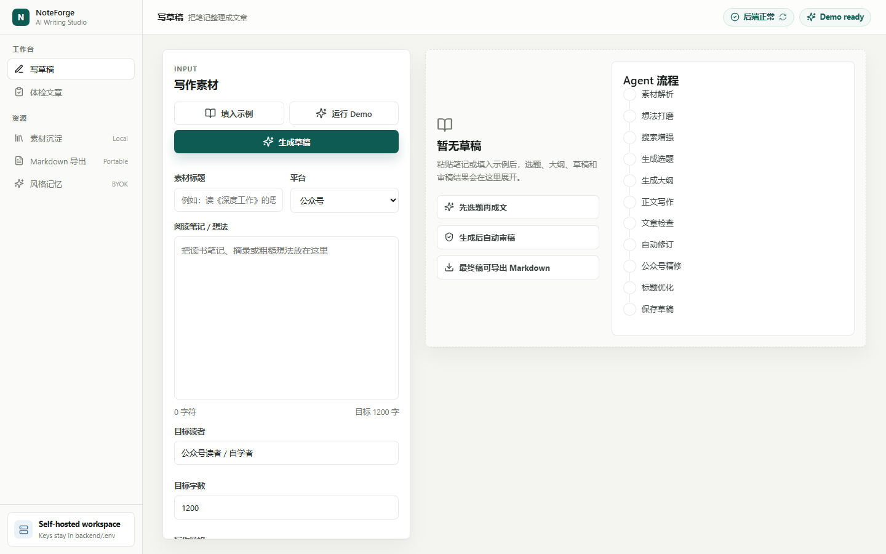
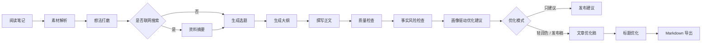

# NoteForge-AI

<p align="center">
  <strong>把粗糙阅读笔记，变成带来源意识、可编辑、可审稿的公众号 / 博客草稿。</strong>
</p>

<p align="center">
  <a href="README.md">English README</a> ·
  <a href="#界面预览">界面预览</a> ·
  <a href="#为什么做它">为什么做它</a> ·
  <a href="#功能亮点">功能亮点</a> ·
  <a href="#快速开始">快速开始</a> ·
  <a href="#demo-模式">Demo 模式</a> ·
  <a href="#路线图">路线图</a>
</p>

NoteForge-AI 是一个自托管 AI 写作工作台，面向经常阅读、记录、思考，并希望持续输出长文内容的人。

## 界面预览

<p align="center">
  
</p>

它会把碎片化的读书笔记、摘录和个人想法整理成一条可见流程：素材解析、想法打磨、按需联网搜索、生成选题和大纲、撰写正文、质量检查、事实风险检查、自动修订、标题优化，最后导出 Markdown。

目标不是制造一键洗稿机器，而是让 AI 处理繁重的第一稿，同时保留你的思考、判断和个人表达。

## 快速速览

| 可以体验什么 | 为什么有价值 |
| --- | --- |
| `写草稿` 工作台 | 粘贴粗糙阅读笔记，得到选题、大纲、正文、审稿信号和 Markdown 导出。 |
| `体检文章` 工作台 | 粘贴已写好的文章，得到可发布 / 需修改 / 暂缓发布判断、标题候选、修改建议和事实风险审查。 |
| 本地 Demo 接口 | 没有 API key 时，也能先体验完整产品流。 |
| OpenAI-compatible 配置 | 可以接 OpenAI、DeepSeek、Qwen 或兼容网关，不需要改应用代码。 |
| 风格记忆 | 从确认过的最终稿里沉淀本地写作画像，影响后续生成和体检建议。 |

## 为什么做它

很多 AI 写作工具从一句 prompt 开始，最后生成一篇很像模板的文章。NoteForge-AI 更关注“从自己的阅读和想法出发”：

- 保留原始素材，并展示想法如何被打磨。
- 在写正文前先给多个选题角度。
- 发布前进行质量体检和事实风险审查。
- 从最终稿学习你的个人写作风格。
- 导出 Markdown，不把内容锁在某个平台里。

## 功能亮点

- 把阅读笔记、摘录、论文笔记或粗糙想法转成长文草稿。
- 自动生成选题候选、大纲、正文草稿和标题候选。
- 对文章质量做审稿，并给出分项评分和修订目标。
- 检查可能缺少来源支撑的事实表达，提示引用、弱化或删除。
- 文章体检页支持“只给建议 / 轻度润色 / 发布稿改写”三种优化模式。
- 基于本地写作画像生成画像驱动建议，说明哪些风格信号影响了修改优先级。
- 文章优化流程接入 LangGraph StateGraph 编排，便于后续扩展人工确认、RAG 和版本 diff 节点。
- 公众号深度打磨模式会额外优化开头、节奏、小标题和结尾。
- 从用户确认过的最终稿中学习个人写作风格。
- 支持导出 Markdown，适合公众号、博客、Newsletter 和个人知识库。
- 支持 OpenAI-compatible Chat Completions API，包括 OpenAI、DeepSeek、Qwen 等。
- 没有 API key 时，也可以先通过本地 Demo 按钮体验完整流程。
- 首屏只保留必要输入，模型、联网搜索和风格记忆都收进可选设置。

## 工作流



## 先看哪里

| 关注点 | 文件 |
| --- | --- |
| 主 Agent 流程 | `backend/app/agents/noteforge_agent.py`, `backend/app/agents/graphs/article_optimization_graph.py` |
| Prompt 行为 | `backend/app/prompts/` |
| Demo 数据 | `backend/app/agents/demo_data.py` |
| API 契约 | `backend/app/schemas/agent.py`, `frontend/src/api/agent.ts` |
| 产品前端 | `frontend/src/pages/`, `frontend/src/components/`, `frontend/src/style.css` |
| 示例素材 | `examples/` |

## 快速开始

### 1. 配置后端环境

```powershell
copy backend\.env.example backend\.env
```

编辑 `backend/.env`：

```env
APP_NAME=NoteForge-AI
DATABASE_URL=sqlite:///./noteforge.db
STORAGE_DIR=storage

LLM_PROVIDER=openai
OPENAI_API_KEY=your_api_key
OPENAI_BASE_URL=https://api.deepseek.com
OPENAI_MODEL=deepseek-v4-flash
LLM_MODEL_OPTIONS=
LLM_REQUEST_TIMEOUT=180

SEARCH_PROVIDER=tavily
TAVILY_API_KEY=your_tavily_key

MIN_REVIEW_SCORE=88
```

联网搜索默认关闭。填好 Tavily key 后，再在可选设置里开启。

### 2. 启动后端

```powershell
cd backend
python -m venv .venv
.\.venv\Scripts\Activate.ps1
pip install -r requirements.txt
python -m uvicorn app.main:app --reload --port 8000
```

接口文档：

```text
http://127.0.0.1:8000/docs
```

### 3. 启动前端

```powershell
cd frontend
npm install
npm.cmd run dev
```

打开：

```text
http://localhost:5173
```

最短使用路径：进入 `写草稿`，粘贴阅读笔记，保持可选设置折叠，点击 `生成草稿`。如果已经有完整文章，就进入 `体检文章` 粘贴正文。

## Demo 模式

如果你还没有模型 API key，也可以体验完整产品流：

1. 启动后端和前端。
2. 打开 `http://localhost:5173`。
3. 在创作页或文章体检页点击 `运行 Demo`。

Demo 模式使用本地示例输出，不会调用模型服务；它仍会把示例 Markdown / JSON 写入 `backend/storage/`，方便测试导出和页面状态。

## Docker

先创建 `backend/.env`，然后运行：

```powershell
docker compose up --build
```

服务地址：

- Frontend: `http://localhost:5173`
- Backend: `http://localhost:8000`

## 示例

示例输入和输出在 `examples/` 目录：

- `examples/deep-work-note.md`
- `examples/article-assessment-input.md`
- `examples/demo-output.md`

这些文件适合用来截图、复现 issue、做手动 QA。

## 质量检查

```powershell
cd frontend
npm.cmd run build
```

```powershell
python -m compileall backend\app
```

GitHub Actions 会在 push 和 pull request 时运行以上检查。

## 路线图

- 在线 Demo 和预置示例。
- 生成过程流式展示。
- 文章版本历史和 diff 对比。
- 更强的引用、来源校验和事实追踪。
- 更多发布平台模板。
- 长任务后台队列。
- 更友好的 API Provider 配置向导。

## 参与贡献

欢迎提交 Issue、功能建议、Prompt 优化、UI 改进和文档补充。详见 `CONTRIBUTING.md`。

## 安全

NoteForge-AI 是 BYOK 项目：你需要使用自己的 LLM 和搜索 API key。请把密钥保存在 `backend/.env`，不要提交到 GitHub。

## License

MIT
